<div align="center">

<!-- ==================== ASCII PORTRAIT ==================== -->
<pre style="background:#0d1117;padding:16px;border-radius:12px;text-align:center;line-height:1.1;font-size:10px;letter-spacing:0px;font-family:'Courier New',monospace;border:1px solid #1e293b;">
<span style="color:#1e3a5f">           ██████████████████████████████</span>
<span style="color:#1e3a5f">         ▓▓▒▒░░░░░░░░░░░░░░░░░░░░░░░▒▒▓▓</span>
<span style="color:#2d4a6e">       ▓▒░░░▒▒▒▒░░░░░░░░░░░░░░░░▒▒▒▒░░░▒▓</span>
<span style="color:#3d5a7e">      ▓▒░░▒▓▓▓▓▒░░░░░░░░░░░░░░░▒▓▓▓▓▒░░░▒▓</span>
<span style="color:#4d6a8e">     ▓▒░▒▓▓▓▓▓▓▒▒░░░░░░░░░░░▒▒▓▓▓▓▓▓▒░░░▒▓</span>
<span style="color:#06b6d4">    ▓▒░▒████████▒▒▒▒▒▒▒▒▒▒▒▓████████▒░░░▒▓</span>
<span style="color:#0891b2">   ▒▒░▒██████████████▒▒▒▓████████████▓░░░▒▒</span>
<span style="color:#0e7490">  ▒░░▒███████████████▓▒▒▒▓█████████████▓░░░▒</span>
<span style="color:#06b6d4">  ▒░▒███████████████▓▒▒▒▒▓█████████████▓▒░░▒</span>
<span style="color:#22d3ee">  ▒▒░██████████████▓▒▒▒▒▒▒▓█████████████▓░░▒▒</span>
<span style="color:#67e8f9"> ░░▒█████████████▓▒▒▒▒▒▒▒▒▒▓████████████▓░░░▒</span>
<span style="color:#a5f3fc"> ░▒████████████▓▒▒▒▒▒▒▒▒▒▒▒▒▓███████████░░░░▒</span>
<span style="color:#cffafe"> ░▒███████▓▓▓▓▒▒▒▒▒▒▒▒▒▒▒▒▒▒▒▓▓████████░░░░▒</span>
<span style="color:#ffffff"> ░▒████░░░░▓▓▒▒▒▒▒▒▒▒▒▒▒▒▒▒▒▒▒▒▒▓████████░░</span>
<span style="color:#cffafe"> ░▒██░░░░░░██▒▒▒▒▒▒▒▒▒▒▒▒▒▒▒▒▒▒▒▒████████░░</span>
<span style="color:#67e8f9"> ░▒█░░░░░░░██░▒▒▒▒▒▒▒▒▒▒▒▒▒▒▒▒▒▒▒▒███████░░</span>
<span style="color:#22d3ee"> ░▒█░░░░░░░██░░▒▒▒▒▒▒▒▒▒▒▒▒▒▒▒▒▒▒▒███████░░</span>
<span style="color:#06b6d4"> ░▒█░░░░░░░░█░░▒▒▒▒▒▒▒▒▒▒▒▒▒▒▒▒▒▒▒███████░░</span>
<span style="color:#0e7490"> ░▒█░░░░░░░░█░░░░▒▒▒▒▒▒▒▒▒▒▒▒▒▒▒▒▒▒██████░░</span>
<span style="color:#0891b2"> ░▒█░░░░░░░░░█░░░░░░▒▒▒▒▒▒▒▒▒▒▒▒▒▒▒▒▒████░░░</span>
<span style="color:#155e75"> ░▒░░░░░░░░░░█░░░░░░░░░▒▒▒▒▒▒▒▒▒▒▒▒▒▒▒▓██░░░</span>
<span style="color:#164e64"> ░▒░░░░░░░░░░██░░░░░░░░░░▒▒▒▒▒▒▒▒▒▒▒▒▓██░░░░</span>
<span style="color:#164e64"> ░▒░░░░░░░░░░███░░░░░░░░░░░▒▒▒▒▒▒▒▒▒▓███░░░░</span>
<span style="color:#155e75"> ▒▒░░░░░░░░░░████████████░░░░▒▒▒▒▒████████░░</span>
<span style="color:#0e7490"> ▒▒░░░░░░░░░░██████████████░░░░░░░▒██████░░░░</span>
<span style="color:#0891b2"> ▒▒░░░░░░░░░░░░░░██████████████░░░░░░░░░░░░░</span>
<span style="color:#164e64">  ▒▒▒▒▒▒▒▒▒▒▒▒▒▒▒▒▒▒▒▒▒▒▒▒▒▒▒▒▒▒▒▒▒▒▒▒▒▒▒▒▒</span>
</pre>

<br/>

<a href="https://git.io/typing-svg">

</a>

<br/>

<a href="https://prasiddha-mainali.onrender.com/">
  
</a>
<a href="https://www.linkedin.com/in/prasiddha-mainali-105bb0352/">
  
</a>
<a href="mailto:prasiddha.mainali2@gmail.com">
  
</a>
<a href="https://instagram.com/_.prasiddha_">
  
</a>

<br/>


</div>


<!-- ==================== GIT LOG LIFE STORY ==================== -->
<div align="center">

### `git log --oneline --life`

</div>

```
a3f92c1 feat(nidaan):  ship AI medical diagnostics platform — EfficientNetB0 + BioMistral-7B
b7e41d0 feat(naterida): autonomous agricultural rover — vision, analytics, sensor intelligence
f10a882 feat(intl):     selected for International Olympiad in AI — representing Nepal
e88d201 feat(nai):      rank #2 nationally — National Olympiad in AI
c9d33aa feat(econml):   causal ML research repo — forecasting, fraud detection, valuation
4a2f7b8 feat(vision):   CNN architectures from scratch in PyTorch — ResNet, EfficientNet
8f1c9d2 fix(self):      rebuilt NATERIDA after losing year one — came back stronger
2d5e8a1 feat(club):     founded college Data Science & AI club
9b0c3f4 feat(first):    wrote first line of Python — Class 11, no mentor, no bootcamp
```


<!-- ==================== ABOUT ME ==================== -->
<div align="center">

```diff
+ ██████╗ ██████╗  █████╗ ███████╗██╗██████╗ ██████╗ ██╗  ██╗ █████╗ 
+ ██╔══██╗██╔══██╗██╔══██╗██╔════╝██║██╔══██╗██╔══██╗██║  ██║██╔══██╗
+ ██████╔╝██████╔╝███████║███████╗██║██║  ██║██║  ██║███████║███████║
+ ██╔═══╝ ██╔══██╗██╔══██║╚════██║██║██║  ██║██║  ██║██╔══██║██╔══██║
+ ██║     ██║  ██║██║  ██║███████║██║██████╔╝██████╔╝██║  ██║██║  ██║
+ ╚═╝     ╚═╝  ╚═╝╚═╝  ╚═╝╚══════╝╚═╝╚═════╝ ╚═════╝ ╚═╝  ╚═╝╚═╝  ╚═╝
```

</div>

<table align="center">
<tr>
<td>

```
┌─────────────────────────────────────────────────┐
│  $ whoami                                       │
│  ───────────────────────────────────────────────│
│  Prasiddha Mainali — AI/ML Researcher & Builder │
│  Location    : Kathmandu, Nepal                 │
│  Education   : Computer Science Student         │
│  Focus       : Deep Learning, Computer Vision,  │
│                Data Analytics, Causal ML        │
│  Currently   : Building Nidaan & research repos │
│  Philosophy  : Understand it deeply or not at all│
└─────────────────────────────────────────────────┘
```

</td>
<td>

```
┌─────────────────────────────────────────────────┐
│  $ cat /etc/passion                             │
│  ───────────────────────────────────────────────│
│  → Self-taught AI/ML from first principles      │
│  → Run my college's Data Science & AI club      │
│  → Obsessed with systems I can rebuild from     │
│    scratch                                      │
│  → Everything I know came from breaking things, │
│    debugging for weeks, and shipping anyway     │
│  → Building at the intersection of AI,          │
│    education, and real-world impact             │
└─────────────────────────────────────────────────┘
```

</td>
</tr>
</table>

<div align="center">

**🔭 Currently building** `Nidaan` — AI-powered medical diagnostics (EfficientNetB0, quantized BioMistral-7B, Whisper multilingual voice input)

**🌱 Exploring** Causal ML via `EconML` research repo (forecasting, fraud detection, valuation)

**💬 Ask me about** Computer vision · Time-series forecasting · Data analytics · Transfer learning

</div>

<!-- ==================== EASTER EGG ==================== -->
<details align="center">
<summary>🔋 <b>The NATERIDA battery story</b></summary>
<br/>

> We were field-testing NATERIDA's sensor array in Dillibazar when the battery pack died mid-run. The rover just... stopped. Dead in the middle of a crop row.
>
> Instead of packing up, I spent the next 3 hours debugging the power management stack on the spot — turns out the voltage regulator was feeding inconsistent power to the LSTM inference module. Rewrote the power-handling logic on my laptop sitting in the dirt, pushed the fix over USB, and the rover finished its route.
>
> That's when I learned: real engineering isn't what happens in the lab. It's what happens when everything breaks and you fix it anyway.

</details>


<!-- ==================== JOURNEY METRO MAP ==================== -->
<div align="center">

### 🚇 The Journey


</div>


<!-- ==================== SKILLS RADAR ==================== -->
<div align="center">

### 🎯 Skill Radar

<table>
<tr>
<td align="center" width="45%">



</td>
<td align="center" width="55%">

**🧠 Deep Learning & AI**


`Transformers` · `EfficientNet` · `BioMistral` · `Whisper` · `ResNet` · `LSTM` · `Res-UNet`

<br/>

**📊 Data Science & ML**


`XGBoost` · `Causal Inference` · `Time-Series` · `Feature Engineering` · `Fraud Detection`

<br/>

**🌐 Stack**


</td>
</tr>
</table>

</div>


<!-- ==================== GITHUB STATS ==================== -->
<div align="center">

### 📊 GitHub Analytics


<br/>


</div>


<!-- ==================== NEURAL NETWORK ==================== -->
<div align="center">

### 🧠 Neural Network in Action



</div>

<!-- ==================== ACTIVITY GRAPH ==================== -->
<div align="center">

### 📈 Contribution Activity


</div>


<!-- ==================== TROPHIES ==================== -->
<div align="center">

### 🏅 GitHub Trophies


</div>


<!-- ==================== FEATURED PROJECTS ==================== -->
<div align="center">

### 🚀 Featured Projects

</div>

<table align="center">
<tr>
<td width="50%">

#### 🏥 [Nidaan — AI Medical Diagnostics](https://github.com/DeV-PrasiddhA/Nidaan)


-00b4d8?style=flat-square)
-e63946?style=flat-square)


Multi-disease diagnostic system covering **malaria, bone fractures, chest X-rays, COVID-19, and brain tumors** — with an AI clinical consultation assistant and blood biomarker analytics dashboard.

[](https://github.com/DeV-PrasiddhA/Nidaan)

</td>
<td width="50%">

#### 🌾 [NATERIDA — Agricultural Exploration Rover](https://github.com/DeV-PrasiddhA/NATERIDA)


Autonomous rover combining fertilizer recommendation, sensor-based intelligence, vision pipelines, and data analytics — **modular intelligent exploration architecture**.

[](https://github.com/DeV-PrasiddhA/NATERIDA)

</td>
</tr>
<tr>
<td>

#### 📈 [EconML — Applied ML in Economics & Finance](https://github.com/DeV-PrasiddhA/EconML-Projects)


Research repo applying causal machine learning to financial forecasting, fraud detection, and real estate valuation using real-world datasets.

[](https://github.com/DeV-PrasiddhA/EconML-Projects)

</td>
<td>

#### 👁️ [Vision Models — CNN Architectures from Scratch](https://github.com/DeV-PrasiddhA/vision-models)


Collection of CNN and computer vision architectures implemented **from scratch and through transfer learning** in PyTorch.

[](https://github.com/DeV-PrasiddhA/vision-models)

</td>
</tr>
</table>


<!-- ==================== CURRENTLY EXPLORING ==================== -->
<div align="center">

### 🎯 Currently Exploring

</div>

<table align="center">
<tr>
<td width="50%">

```
 ▸ Deep Neural Networks & Representation Learning
 ▸ Computer Vision & Transfer Learning (PyTorch)
 ▸ Causal Machine Learning & Econometrics
 ▸ Data Analytics & Feature Engineering
```

</td>
<td width="50%">

```
 ▸ Model Optimization & Quantization (4-bit, INT8)
 ▸ Explainable AI & Interpretability
 ▸ MLOps & Production ML Pipelines
 ▸ AI for Healthcare & Education
```

</td>
</tr>
</table>


<!-- ==================== PHILOSOPHY ==================== -->
<div align="center">

### 💭 Philosophy

> *"Technology changes quickly. Strong fundamentals endure."*

I believe the fastest way to actually learn AI is to build continuously, understand what's happening beneath the abstraction layers, and stay curious enough to keep breaking things on purpose.

</div>


<!-- ==================== RANDOM DEV QUOTE ==================== -->
<div align="center">

### 💬 Random Dev Quote


</div>


<!-- ==================== CONNECT ==================== -->
<div align="center">

### 📫 Let's Connect

<a href="https://prasiddha-mainali.onrender.com/">
  
</a>
<a href="https://www.linkedin.com/in/prasiddha-mainali-105bb0352/">
  
</a>
<a href="mailto:prasiddha.mainali2@gmail.com">
  
</a>
<a href="https://instagram.com/_.prasiddha_">
  
</a>

<br/><br/>

*"Learning. Building. Researching. Shipping."*

<br/>


</div>